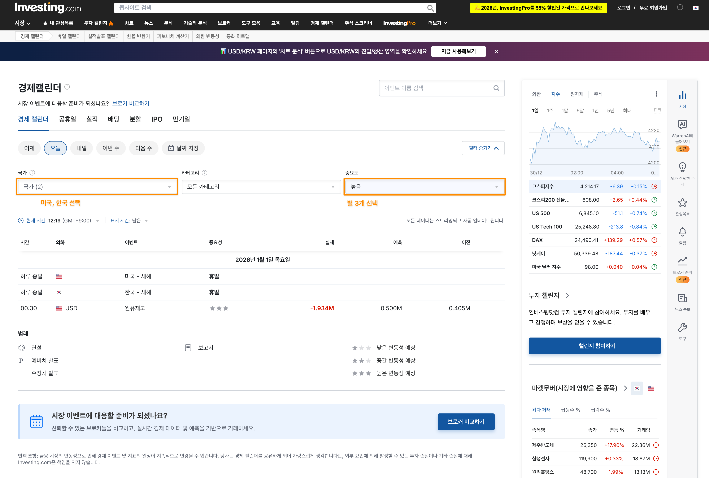
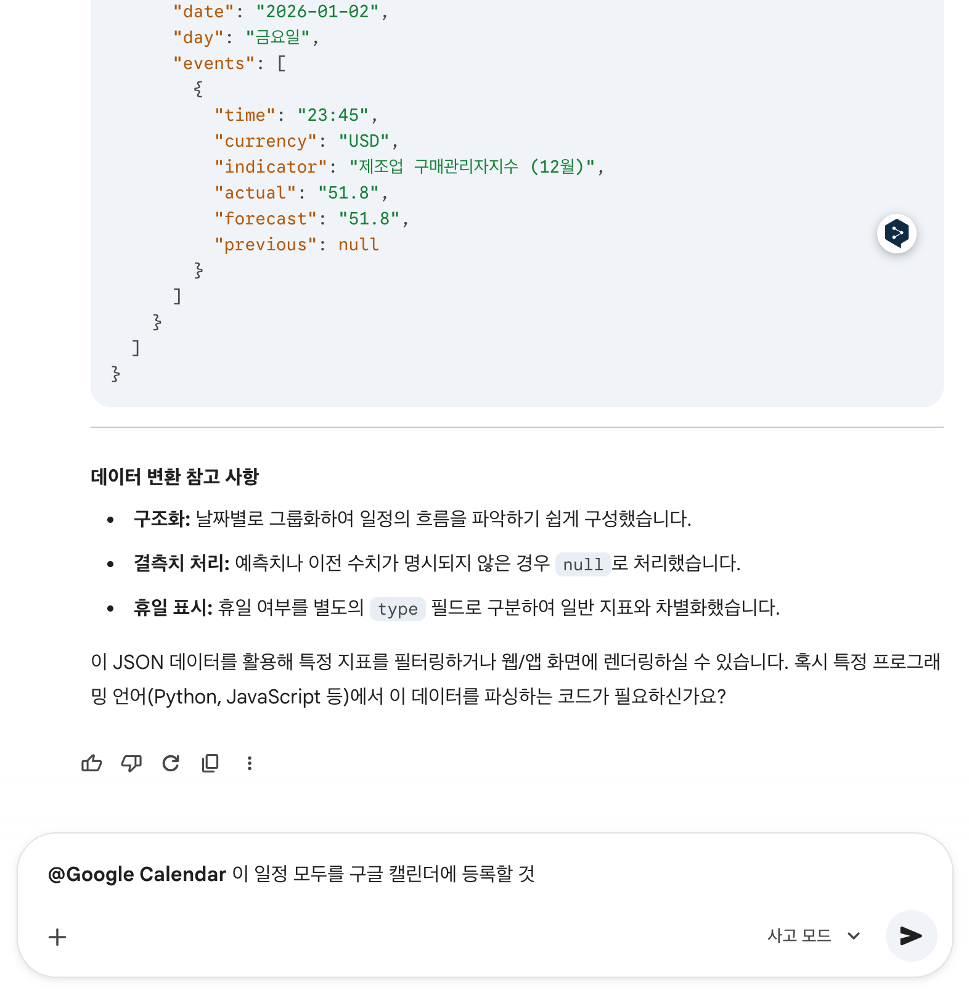

# 경제 캘린더 기반 Youtube 스크래핑

Youtube 영상은 좀 싫은데 내용에 프롬프트가 어떤식으로 구성되는지 관심가서 정리.. 왜 유튜버 세이들은 유명인 얼굴 지 멋대로 가져다가 돈도 안내고 쓰는가... 순다피차이가 니 가족이냐? 그리고 기술설명에 니 얼굴을 그리 강조하면 모니터 앞에서 보는 시청자는 어색할거란 생각은 안하냐... 

개인적으로는 도움은 안됐다. 걍 프롬프트 다른 사람은 어떻게 작성하나는 봤다. 기술 분석을 AI로 하면 몇일 차에 얼마였고 이런 내용을 알아듣기는 하는건지... 영상은 그냥 추억용으로 만든건 아니겠지?

## 출처
https://www.youtube.com/watch?v=OZTPDK6IhyU

## 내용
### 경제 일정 알림 기능
인베스팅닷컴 ➝ 경제캘린더

<br/>
<br/>

테이블에 적힌 텍스트 들을 모두 복사해서 Gemini 채팅창에 붙여넣고 "json 으로 변환할것" 이라고 입력


<br/>
<br/>
"이 일정 모두를 구글 캘린더에 등록할 것" 이라고 입력




야스.. 야스... yes. 야스 .... 야한거 말고 야스...


<br/>

다음과 같이 매일 아침에 브리핑하라고 채팅을 작성


### 뉴스기사 요약
> 사실 주식투자를 뉴스기사로 하면 진짜 진짜 단타라는 이야기인데... 추세매매에서는 하나도 필요없다는..


```md
COD(Chain of Density) 밀도의 사슬

Article [여기에 원문 텍스트를 입력하세요]
너는 '기관 리서치 데스크'처럼 기사 내용을 왜곡없이 압축해 투자 판단 재료로 만드는 애널리스트다. 아래 기사를 Chain of Density 방식으로 5개로 요약하되, 최종 출력은 오직 Step 5 최종 요약문만 출력하라.

[카운트 규칙 - 매우 중요]
- 본문이 한국어면 "단어" 대신 **공백 기준 어절(띄어쓰기 묶음) 80개 이하**로 제한한다.
- 본문이 영어면 **단어 80개 이하** 로 제한한다.


[공통 안전 규칙]
- 추측/상상/일반론 금지. 기사에 없는 내용은 절대 추가하지 마라.
- 정보가 없으면 해당 부분은 "기사에 명시 없음"으로 표기하라
- 엔티티를 추가할 때 문장을 늘리지 말고 기종 문장안에 자연스럽게 끼워넣어 정보 밀도만 높여라.


[Step 5에 반드시 포함할 요소]
(1) 사건/이슈 한줄 정의
(2) 핵심 주체(기업/국가/기관) + 핵심 수치/날짜 (있다면)
(3) 원인 -> 결과 구조
(4) 시장 트리거 (정책/규제/실적/금리/공급망/지정학/수급) 1개 이상
(5) 불확실성/제약 1개 (없으면 "기사에 명시 없음")

[5단계 수행]
Step 1. 초기 요약 (제한 이내)
Step 2. Step1 에서 빠진 '투자 민감' 핵심 엔티티 3개 식별
Step 3. 길이 유지하며 Step2 엔티티를 자연스럽게 포함해 재작성
Step 4. Step 3 에서 또 빠진 "투자 민감" 새 엔티티 3개 식별 (중복 금지)
Step 5. 제한을 엄격히 지키며 Step 4 엔티티를 포함해 최종 재작성
- 엔티티는 "정책/규제/실적/금리/공급망/지정학/수급"과 직접 연결되는 것을 우선하라.


[자체 검증 - 출력 금지]
- 최종 Step 5 가 (1) ~ (5) 를 모두 포함했는지 내부적으로 체크하라.
- 길이 제한을 넘으면 문장을 다시 다듬어 제한 이내로 맞춰라.
- 위 검증 과정은 절대 출력하지 마라.

[최종 출력 규칙]
- Step 1~4 및 검증과정은 절대 출력하지 마라.
- 오직 [Step 5 최종 요약문]만 출력하라.
```
<br/>

### 기술적 분석
차트 데이터를 csv 로 추출한다. HTS에서는 된다고 하는데 난 안되네. Alpha Vantage 나 이런건 가능한가봄.

프롬프트는 다음과 같이 작성
```
이 구글 시트는 삼성전자의 최근 1년 일봉 데이터야. 이동 편균선 기준으로 골드크로스와 데드 크로스를 찾아줘.

RSI 가 70 이상이거나 30이하일때 주가 움직임을 알려주고, MACD 매수 매도 신호도 분석해줘. 마지막으로 이 결과들을 종합해 최종 투자 전략을 시나리오로 정리해줘
```

### 뭔 교슈가 했다는 프롬프트
이것까지는 모르겠다.


