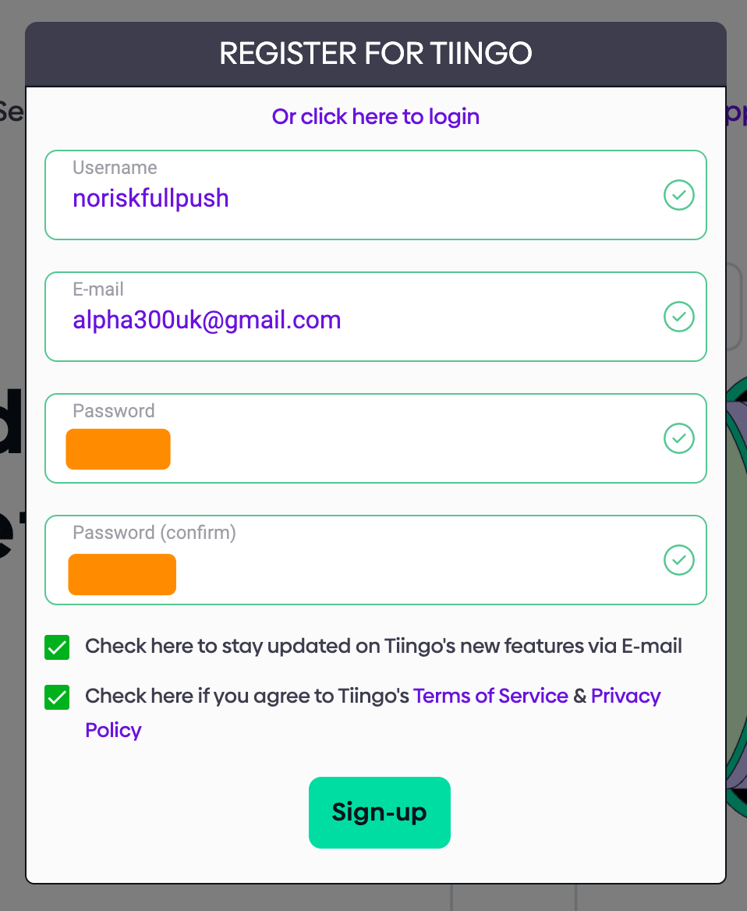
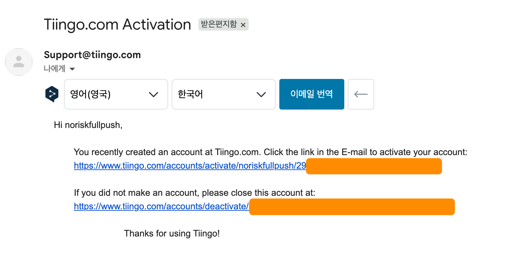
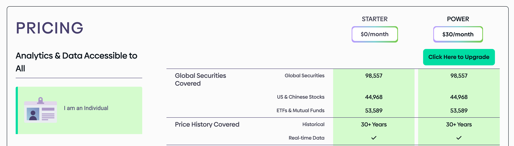
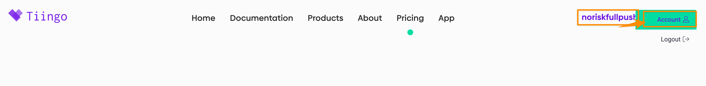

# tiingo 가입 및 세팅

## 회원 가입
참고) 계정명 기억안날까봐 가입 계정 캡처를 함

<br/>
<br/>

계정활성화 하라는 안내가 오는데 링크를 눌러서 활성화 한다.

<br/>
<br/>

## 요금제
https://www.tiingo.com/about/pricing 을 확인해보면 상업적으로 사용하지 않고 개인용으로 사용할 경우 요금제가 2026.01 현재에는 다음과 같이 한달에 `30$` 정도 이다.


일단 한달 동안은 테스트 용으로 쓸 것이고 돈을 많이 들일 생각이 없기에 무료요금제만 사용하기로 했다.

## API Token
계정명 클릭 후 Account 클릭


<br/>

좌측 사이드바의 API/Token 클릭 ➝ 복사


## keyring 을 이용한 안전한 사용
코드 내에 주입해서 사용하는 방법도 있고 여러가지가 있겠지만, 실습환경에서는 가급적 프롬프트에서 사용자가 입력해줘야 하는 방법을 사용하기로 했다.

### keyring 설치
```bash
pip install keyring

## or

conda install keyring
```
내 경우 conda install keyring 을 해주었다. miniforge 를 사용하면 이렇게 pip 대신 conda를 써야 하는지는 잘 모른다.<br/>

### 사용법
다음의 명령어를 bash 에 수행해서 현재 터미널 세션에 세팅해서 사용할 수 있다.
```bash
keyring set [서비스명] [사용자명]

### e.g.
keyring set tiingo admin
```
이렇게 하면 비밀번호나 토큰을 알려달라고 하는데 입력해주면 되며 터미널 내에도 몇글자인지도 안나타나고 그래서 조금 안전하다.<br/>


내 경우에는 위의 명령을 쉘 스크립트로 만들어둬서 재사용이 되도록 해주었다.
```bash
echo "Type your tiingo username : "
keyring set tiingo $1
```
<br/>


